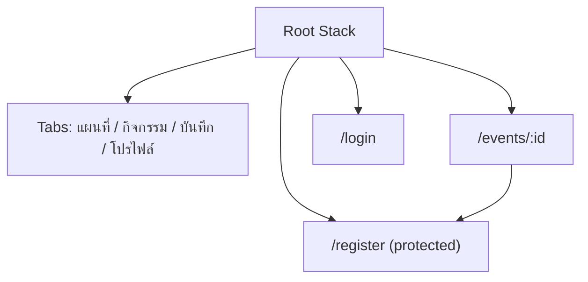

# เติมเกณฑ์สัปดาห์ 1–10 จากแอป Week 13

แอปนี้ยังเป็น Khon Kaen Dino Explorer; ข้อมูล My Trip คือ POI ส่วน `กิจกรรมที่บันทึก` คือ Event Favorites ที่เพิ่มต่างหาก

## ทดลอง API และบัญชีจำลอง

API จำลองนี้ใช้เฉพาะเครื่องพัฒนา/เครือข่ายที่เชื่อถือได้ ไม่ใช่ระบบบัญชีจริง และข้อมูลลงทะเบียนเก็บในหน่วยความจำของ server เท่านั้น

1. สร้างรหัสผ่านใช้ทดสอบเท่านั้น แล้วกำหนด `CAMPUS_TEST_EMAIL`, `CAMPUS_TEST_PASSWORD` ใน terminal ที่รัน `npm run api:mock` (ไม่ใส่รหัสผ่านใน Git)
2. ตั้ง `EXPO_PUBLIC_API_URL=http://<LAN-IP-ของคอมพิวเตอร์>:4100` ใน `.env.local` บนเครื่องที่รัน Metro เพื่อให้มือถือเชื่อมได้; URL นี้ไม่ใช่ secret แต่ข้อมูลบัญชีจะส่งแบบ HTTP ใน Lab นี้ จึงต้องใช้บัญชีสมมติเท่านั้น
3. `npx expo start -c` แล้วเปิด กิจกรรม → เลือกกิจกรรมจาก API → เข้าสู่ระบบ → ลงทะเบียน ผู้ใช้เลือกรูป JPEG/PNG ไม่เกิน 3 MB ได้ ระบบตรวจ token ที่ API จำลอง และ POST ซ้ำไม่สร้างรายการใหม่สำหรับคนเดิม
4. ตั้ง airplane mode แล้วเปิด Event list อีกครั้ง เพื่อตรวจ cache/banner/เวลาอัปเดต; POI และกิจกรรมในเครื่องยังอ่านได้
5. สำหรับ Development Build ให้ล็อกอิน EAS แล้ว `npx eas-cli@latest build --platform android --profile development`, ติดตั้ง binary และ `npx expo start --dev-client` (ยังไม่ได้สร้างจากสภาพแวดล้อมนี้)

API contract สำหรับ backend จริง: `GET /events`, `GET /events/:id`, `POST /auth/login` ตอบ `{accessToken,user:{id,name}}`, `GET /auth/me` ด้วย Bearer token, `POST /events/:id/registrations` ด้วย Bearer token ตอบ `{registrationId}` และ `POST /events/:id/registrations/:registrationId/photo` แบบ multipart ด้วย Bearer token. Backend จริงต้องใช้ HTTPS, validation ของชนิด/ขนาดและเนื้อหาไฟล์, expiry/refresh และจัดการสิทธิ์ฝั่ง server

## Route และเจ้าของ state

การเปิด Detail จากแท็บกิจกรรมใช้ Root Stack จึงกลับมาที่แท็บเดิมเมื่อกด Back ส่วน deep link `/events/<id>` ใช้ ID เพื่อค้นข้อมูล ไม่ส่ง object ผ่าน URL; ต้องทดสอบ cold start/Android Back บนอุปกรณ์อีกครั้ง

| State | เจ้าของ | ที่เก็บ |
| --- | --- | --- |
| คำค้น/ฟอร์มลงทะเบียน/ภาพร่าง | หน้าจอนั้น | memory; ไม่เขียน URI ชั่วคราวลง storage |
| Favorite IDs ของกิจกรรม | `FavoritesProvider` | AsyncStorage |
| My Trip POI IDs | service เดิม | AsyncStorage |
| Event list จาก API | feature hook และ remote cache | AsyncStorage key ที่มี version พร้อม `updatedAt` |
| Session token | `SessionProvider` | SecureStore; ล้างเมื่อ logout หรือ 401 |

## ผลทดสอบ network และรูปภาพ

| กรณี | ผล |
| --- | --- |
| ไม่ล็อกอินแล้วยิง POST registration | API จำลองตอบ 401 ใน automated test |
| Login → restore session → POST registration → POST ซ้ำ | ตอบสำเร็จ; POST ซ้ำได้ registration ID เดิมใน automated test |
| ไม่มี network แต่มี cache | unit test ยืนยันว่าแสดงข้อมูล cache, `updatedAt` และ `offline: true` |
| API ตอบ 401 | unit test ยืนยันว่าตรวจ `response.ok` ก่อนอ่าน JSON |
| API ส่ง event ที่โครงสร้างผิด | unit test ยืนยันว่า reject ข้อมูล |
| ส่งภาพ PNG ที่ตรง MIME กับ signature / แอบอ้าง MIME | API จำลองตอบ 200 / 400 ตามลำดับใน automated test |
| API 404, 500 และ JSON ผิดรูป | unit test ตรวจ error โดยไม่ใช้ network จริง |
| เครือข่ายช้า, รูปถ่ายจริง และ offline บนอุปกรณ์ | ยังไม่ได้ทดสอบครบ |

รูปภาพบนหน้าลงทะเบียนขอ permission เมื่อผู้ใช้กดเลือกรูปเท่านั้น, ยกเลิกแล้วคงข้อมูลในฟอร์ม, แสดง preview และนำออกหรือเปลี่ยนได้ เมื่อสิทธิ์ถูกปฏิเสธถาวรมีปุ่มเปิด Settings. URI ที่ได้เป็นไฟล์ชั่วคราวบนเครื่อง; server จริงต้องรับ bytes จาก multipart และตรวจเนื้อหาอีกครั้ง

## Storage, location และความปลอดภัย

| ข้อมูล | วิธีเก็บ/ใช้ | Lifecycle |
| --- | --- | --- |
| Favorite/POI | AsyncStorage | คงอยู่เมื่อรีสตาร์ต; JSON เสียให้รายการว่าง |
| Event cache | AsyncStorage | เก็บข้อมูลสาธารณะพร้อม `updatedAt`; ล้างเมื่อเปลี่ยน schema/version |
| Session token | SecureStore | ล้างเมื่อ logout/401; ไม่ใส่ URL หรือ log |
| รูปที่ยังไม่ submit | URI ชั่วคราวใน form state | หายเมื่อออกจากหน้า; server เก็บเมื่อ upload สำเร็จ |
| พิกัดปัจจุบัน | ขอ foreground ตอนกดปุ่ม | แสดงบนจอ ไม่เก็บประวัติหรือขอ background |

Android Expo Go ใช้แผนที่ Leaflet/OSM ผ่าน WebView ในหน้า POI; iOS ใช้ native map. สถานที่จัดกิจกรรมดูได้โดยไม่ต้องอนุญาตตำแหน่ง ส่วน Android production ต้องกำหนดและจำกัด Google Maps API key ตาม package/signing certificate แล้ว rebuild หาก native config เปลี่ยน ค่า `EXPO_PUBLIC_API_URL` เป็น URL ที่เปิดเผยได้เท่านั้น ไม่ใส่ secret ลงในตัวแอป, log หรือ fixture; API จริงต้องตรวจ authorization ทุก request, ใช้ HTTPS, จำกัดข้อมูลส่วนบุคคลและกำหนดอายุ token

## สถานะงานที่ตรวจสอบได้

| สัปดาห์ | สิ่งที่เพิ่ม/มีแล้ว | สิ่งที่ยังต้องทำหรือยืนยัน |
| --- | --- | --- |
| 1 | Expo/TypeScript/Profile/README | ภาพหรือวิดีโอจากเครื่องจริง และ baseline SDK/Node จากผู้สอน |
| 2 | EventCard, mock Event, Event Favorites พร้อมปุ่มและ stable ID | วิดีโอเปิด/บันทึก/กดซ้ำ, รูปเสีย/ข้อความยาว |
| 3 | FlatList, Safe area, empty/error UI และ accessibility เดิม | ภาพสองขนาดจอและ ready/empty/error ครบทุกกรณี |
| 4 | Root Stack ครอบ Tabs, dynamic event detail, invalid ID; Android/iOS bundle ผ่าน | ผลทดสอบ deep link/Android Back บนอุปกรณ์ |
| 5 | Search, controlled Login/Registration, validation, กันส่งซ้ำ, Event Favorites + FavoritesProvider/useEventFavorites และตาราง state ownership | วิดีโอใช้งานจริงบนเครื่อง |
| 6 | API boundary, status handling, payload validation, local server จำลอง, pull-to-refresh | backend จริง, ทดสอบ offline/404/500/slow/invalid JSON ให้ครบ |
| 7 | AsyncStorage, remote event cache + updatedAt/offline UI, SQLite schema POC และ storage matrix | วิดีโอ offline/restart; cache invalidation เมื่อ backend เปลี่ยน schema |
| 8 | Login + SecureStore + restore + logout + protected registration route; API จำลองตรวจ Bearer token | Development Build จริง; token refresh/expiry กับ backend จริง และวิดีโอ flow |
| 9 | Camera/Picker, preview/remove/replace ในฟอร์ม, ส่ง multipart พร้อมตรวจ MIME/ขนาดฝั่ง client และ MIME/signature ฝั่ง API จำลอง | ทดสอบ permission denied/canceled กับรูปจริงบน Android/iOS |
| 10 | POI maps, แผนที่ใน Event detail, แตะวางหมุดอิสระแล้วบันทึกพิกัดในกิจกรรม, foreground current location และตาราง Android/iOS | วิดีโอ venue/manual/current location บน Android/iOS และทดสอบเครื่องจริง |
| 13 | 28 tests, static checks, Android/iOS bundles และรายงานเดิม | EAS Preview APK และ clean install จริง |

การทดสอบบนเครื่องพัฒนาผ่าน `npm run typecheck`, `npm run lint`, `npm test` (Node 15 + Jest 13), Android และ iOS Metro export. Expo Doctor 21/21 ผ่านบน GitHub Actions หลังปรับ dependencies; รอบล่าสุดบนเครื่องนี้รอข้อมูลภายนอกไม่จบ จึงต้องดู CI หลัง commit ชุดใหม่นี้อีกครั้ง ยังไม่ได้ทดสอบกล้อง ตำแหน่ง session หรือ notification บน binary หลังเพิ่ม native packages; ต้องสร้าง binary ใหม่

**ข้อจำกัด:** งานที่ยังอยู่คอลัมน์ขวายังนับว่าไม่ครบตาม Definition of Done ของรายวิชา อย่าส่งตารางนี้เป็นหลักฐานว่าผ่านทุกสัปดาห์แล้ว
