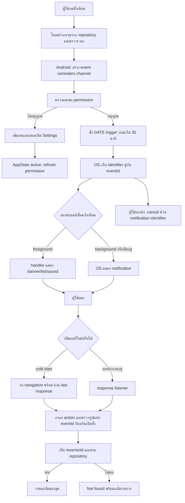

# Lab 11 — Local Event Reminder

เพิ่มใน Khon Kaen Dino Explorer: หน้าแรก → กิจกรรมและการแจ้งเตือน → รายละเอียดกิจกรรม

## การใช้งาน

1. รัน `npm install` และ `npx expo start --clear` แล้วเปิดผ่าน Expo Go
2. เลือกกิจกรรมตัวอย่าง หรือกรอกชื่อแล้วเลือกวันที่และเวลาไทยในฟอร์มด้านบน (เลือกเวลาอีกประมาณ 31 นาทีเพื่อทดลองเตือนใน 1 นาที)
3. กด “เตือนก่อนกิจกรรม 30 นาที” ระบบจึงขอ permission ถ้ายังไม่ได้อนุญาต
4. แตะ notification เพื่อเปิด `/events/[id]`
5. กด “ยกเลิกการเตือนทั้งหมดของกิจกรรมนี้” เพื่อยกเลิกทั้งการเตือนจริงและการทดสอบที่ยังรอส่ง

ปุ่มทดสอบ 15 วินาทีแยกจากการเตือนจริง ไม่เปลี่ยนเวลาเริ่มของกิจกรรม ใช้เพื่อฝึก app lifecycle ได้เร็วขึ้น กิจกรรมตัวอย่างไม่ใช่อีเวนต์จริงของสถานที่ และเวลาถูกสร้างครั้งแรกแล้วเก็บใน AsyncStorage ไม่เลื่อนเวลาเมื่อเปิดแอปใหม่

เวลาเก็บเป็น ISO UTC และแสดงเป็น Asia/Bangkok พร้อมป้ายเวลาไทย การตั้งเตือนใช้เวลาสัมบูรณ์ แอปนี้ยังไม่มีการแก้เวลากิจกรรมหรือระบบ login; หากเพิ่มการแก้เวลาต้องยกเลิกและตั้งเตือนใหม่ และหากเพิ่ม login ต้องเก็บ intent ผ่านขั้นตอนตรวจสิทธิ์ก่อนเปิดรายละเอียด

## Notification lifecycle diagram

OS notification queue เป็นแหล่งข้อมูลถาวรของคู่ identifier/eventId; อ่านกลับด้วย getAllScheduledNotificationsAsync จึงไม่ต้องทำสำเนาที่อาจค้างหลังส่งสำเร็จ Payload มีเฉพาะ eventId และข้อความบน lock screen เป็นข้อความทั่วไป ไม่แนบ event object หรือข้อมูลส่วนตัว ใช้ ID เปิด route ที่กำหนดตายตัว ไม่ใช้ URL จาก payload

## ตารางทดสอบบนอุปกรณ์จริง

รายการด้านล่าง **ยังไม่ได้ทดสอบบนอุปกรณ์จริง** ห้ามใช้เป็นผลผ่านจนกว่าจะทดสอบและแนบหลักฐาน

| กรณี | ขั้นตอน | ผลที่คาดหวัง | ผลจริง |
|---|---|---|---|
| Permission ครั้งแรก | กดตั้งเตือนหลังติดตั้งใหม่ | prompt เกิดจากการกดเท่านั้น; Android มี channel แล้ว | รอทดสอบ |
| ปฏิเสธ permission | ปฏิเสธ prompt | ไม่มี schedule; มีปุ่มเปิด Settings | รอทดสอบ |
| กลับจาก Settings | เปลี่ยนสิทธิ์แล้วกลับเข้าแอป | สถานะสิทธิ์ refresh; กดตั้งเตือนใหม่ได้ | รอทดสอบ |
| Foreground | กดทดสอบ 15 วินาที อยู่ในแอปแล้วแตะ banner | เปิดรายละเอียดกิจกรรมเดียวกับที่ตั้งเตือน | รอทดสอบ |
| Background | ตั้งเตือนแล้วกลับ Home | OS แจ้งเตือน; แตะแล้วเปิดรายละเอียด | รอทดสอบ |
| Cold start | ตั้งเตือน ปิดแอป แล้วแตะ notification | เปิดรายละเอียดหลัง navigator พร้อม ไม่เปิดซ้ำ | รอทดสอบ |
| เตือนจริง 30 นาที | สร้างกิจกรรมเริ่มอีก 31 นาทีแล้วตั้งเตือน | รับในประมาณ 1 นาที | รอทดสอบ |
| ยกเลิก | ตั้งเตือนแล้วกดยกเลิกก่อนถึงเวลา | ไม่มี notification จากรายการที่ยกเลิก | รอทดสอบ |
| เปิดแอปใหม่ | ตั้งเตือนแล้วเปิดใหม่ก่อนกำหนด | สถานะยังตั้งเตือน; ยกเลิกได้ | รอทดสอบ |
| กดตั้งซ้ำ | ตั้งเตือนกิจกรรมเดิมหลายครั้ง | มีการเตือนจริงเพียงรายการเดียว | รอทดสอบ |
| เลยเวลาเตือน | เลือกกิจกรรมที่เริ่มในไม่ถึง 30 นาที | แจ้งว่าเลยเวลา ไม่มี schedule | รอทดสอบ |
| Invalid ID | payload ไม่มี ID, ID เป็น number/array/path | ไม่ navigate | unit test + รออุปกรณ์ |
| Deleted ID | เปิด /events/deleted-event | ไม่พบกิจกรรม และกลับรายการได้ | รอทดสอบ |
| Keyboard / safe areas | เปิดฟอร์มบน iPhone และ Android | เลื่อนถึง input/ปุ่มได้; header/bottom ไม่ชนขอบระบบ | รอทดสอบ |
| เวลาไทย | เปลี่ยน timezone เครื่อง | เวลาแสดงมีป้ายเวลาไทย; timestamp เตือนไม่เลื่อน | รอทดสอบ |

ใช้ development/preview build บนอุปกรณ์จริงเพื่อยืนยัน cold start ของแอปตัวเอง: Expo Go เป็นแอปโฮสต์ จึงไม่แทนพฤติกรรม binary ของเราได้ทั้งหมด Android force-stop ใน Settings ไม่เหมือนปิดแอปปกติ และอาจระงับ notifications จนเปิดแอปใหม่ การส่งจริงยังขึ้นกับ Focus/Do Not Disturb, สิทธิ์ channel และข้อจำกัดระบบ ไม่รับประกันความตรงระดับวินาที

Native folders ที่มีอยู่เดิมอาจเก่ากว่า config นี้ หากจะ build เองต้อง sync native project กับ plugins ใหม่ก่อน โดยรักษาการแก้ native เดิมไว้ งานนี้ยังไม่ได้ regenerate native folders หรือสร้าง binary และ Android build ยังต้องตั้ง Google Maps key ของแอปเอง

## วิดีโอที่ต้องส่ง

ยังไม่ได้บันทึกวิดีโออุปกรณ์จริง ใช้ลำดับนี้:

1. แสดงหน้ากิจกรรมและรายละเอียด
2. สร้างกิจกรรมเริ่มอีก 31 นาที แล้วกดเตือนก่อน 30 นาทีและอนุญาต
3. แสดงสถานะตั้งเตือนและเวลาเตือน
4. กลับ Home รอประมาณ 1 นาที (ตัดช่วงรอได้)
5. แสดง notification → แตะ → แสดงชื่อและรายละเอียดกิจกรรมเดิม
6. ถ่ายแยกกรณี foreground และ cold start; ใช้ปุ่มทดสอบ 15 วินาทีเพื่อประหยัดเวลา โดยระบุว่าเป็นการทดสอบ

## Exit ticket

- Local: แอปตั้งเวลาให้ OS บนเครื่อง; Push: server ส่งผ่าน push service ไม่จำเป็นต้องตั้งเวลาไว้ในเครื่อง
- Payload ใช้ ID เพื่อให้โหลดข้อมูลล่าสุด ตรวจว่ากิจกรรมยังอยู่ และลดข้อมูลส่วนตัวที่ส่งผ่าน notification
- Foreground ต้องกำหนด handler ให้แสดง banner; background ใช้ response listener เมื่อแตะ; cold start ต้องอ่าน last response หลัง navigation พร้อม พร้อมกรอง action และป้องกัน response เดิมเปิดซ้ำ

## แหล่งอ้างอิง

- [Expo Notifications](https://docs.expo.dev/versions/latest/sdk/notifications/): local notifications ยังมีใน Expo Go; remote push บน Android ต้อง development build
- [Expo Router installation](https://docs.expo.dev/router/installation/)

## ตรวจอัตโนมัติ

`node --test tests/reminders.test.cjs` ตรวจ service ผ่าน native mocks: ลำดับ channel/permission, เวลาเตือน, denied/past/missing event, payload, ตั้งซ้ำ, แยก test และ cancel ไม่แทนการทดสอบ native delivery หรือ lifecycle จริง

`npm run check` ตรวจ TypeScript และ Expo config; `npx expo export --platform ios --platform android` ตรวจ bundle ทั้งสองแพลตฟอร์ม
