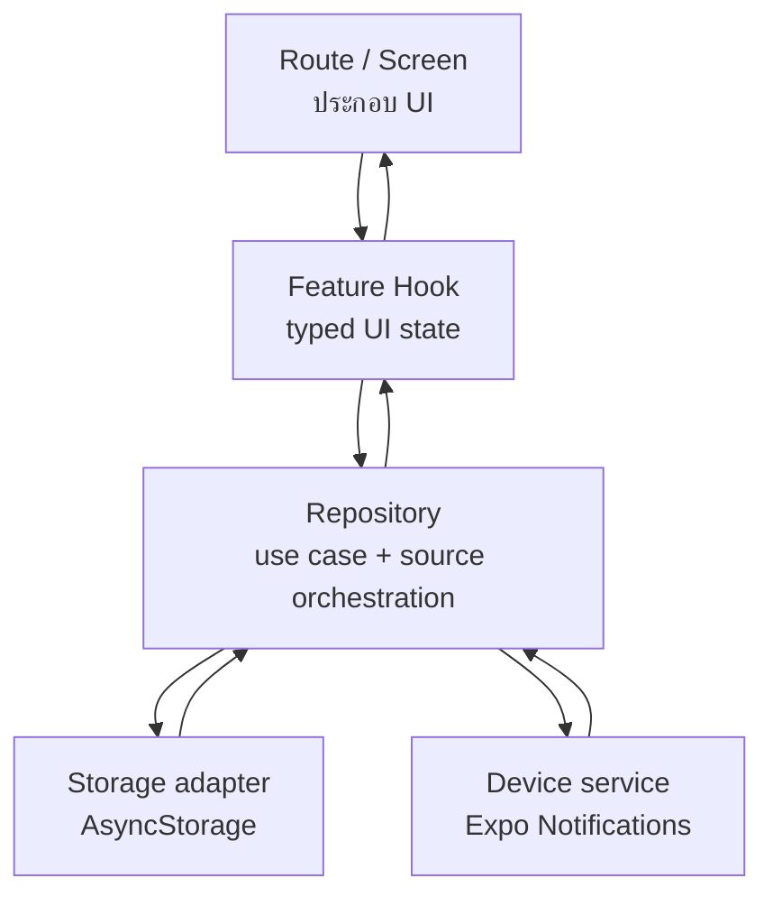

# Lab 12 — Architecture, Performance และ Accessibility

งานนี้ต่อยอดจาก **Khon Kaen Dino Explorer — Week 11** โดยหยุดเพิ่มฟีเจอร์ใหม่และปรับ boundary ตามปัญหาที่พบจริง ฟีเจอร์แผนที่ กิจกรรม และ Local Notification เดิมยังทำงานเหมือนเดิม

## 1. Architecture และ Data flow



### Boundary และเหตุผล

| ชั้น | ไฟล์ตัวอย่าง | หน้าที่ | เหตุผลที่แยก |
|---|---|---|---|
| Route/Screen | `app/events/index.tsx`, `app/events/[id].tsx` | ประกอบ UI, navigation และ alert | ไม่ควรรู้ storage key หรือ Expo device API |
| Feature hook | `features/events/hooks/useEvents.ts`, `useEventDetail.ts` | loading/error state, lifecycle และคำสั่งจาก UI | รวม state transition ที่ screen ใช้และทดแทน UI ได้ง่าย |
| Repository | `repositories/eventRepository.ts`, `reminderRepository.ts` | validation, use case และประสานหลายแหล่งข้อมูล | เป็นจุดเดียวของกฎ เช่น cutoff 30 นาทีและ serialized scheduling |
| Storage | `storage/eventStorage.ts` | อ่าน/เขียน JSON ด้วย AsyncStorage | ซ่อน key และ serialization จาก business logic |
| Device service | `services/notificationService.ts` | permission, channel และ Expo Notifications | ซ่อน API เฉพาะแพลตฟอร์มและทำให้ repository ทดสอบด้วย fake boundary ได้ |
| Types | `features/events/types.ts` | `CampusEvent` และ validation ของ ID | ป้องกัน payload/route ส่งค่าที่ไม่ถูกชนิด |

ไม่สร้าง abstraction เพิ่มสำหรับ `pointsOfInterest` เพราะเป็นข้อมูลคงที่และยังไม่มี API/cache orchestration การห่อด้วย repository ตอนนี้จะเป็นเพียง pass-through ที่ไม่เพิ่มประโยชน์

### Source of truth

| ข้อมูล | Source of truth | State ใน UI |
|---|---|---|
| Event | AsyncStorage ผ่าน `eventRepository` | snapshot ใน `useEvents`/`useEventDetail` |
| Reminder | scheduled notification queue ของระบบปฏิบัติการ | `ReminderSnapshot` ที่โหลดใหม่เมื่อ focus/กลับเข้าแอป/ได้รับ notification |
| Notification permission | ระบบปฏิบัติการ | boolean snapshot; refresh เมื่อ AppState กลับเป็น active |
| POI ที่เลือก | local state ของ `PoiExplorerScreen` | `selectedPoi` |

## 2. Performance evidence

### ปัญหาที่ตรวจพบก่อนแก้

Baseline คือ commit Week 11 `f9b4589`:

- Event list ใช้ `ScrollView` และ `events.map(...)` จึงสร้าง card ทุกใบตั้งแต่เปิดหน้า
- callback เปิดรายละเอียดถูกสร้างใหม่ภายในแต่ละรอบ render
- เมื่อกรอกชื่อ/เลือกเวลา state ของฟอร์มเปลี่ยน screen ทั้งหน้าและรายการถูกประเมินใหม่

### การแก้ bottleneck

- เปลี่ยน Event list เป็น `FlatList`
- จำกัด initial batch เป็น 6, batch ถัดไป 6 และ `windowSize={5}`
- แยก `EventCard` และห่อด้วย `memo`
- ทำ `openEvent` และ `renderEvent` ให้ stable ด้วย `useCallback`
- เปิด `removeClippedSubviews` เฉพาะ Android
- ใช้ React `Profiler` บันทึก `actualDuration` และ `baseDuration` ใน development console

หลักฐานเชิงโครงสร้างถูกตรวจอัตโนมัติใน `tests/architecture.test.cjs` การเปลี่ยนจาก eager rendering จำนวน **N cards** เป็น virtualized window ลดจำนวน card ที่ mount พร้อมกันเมื่อผู้ใช้มีรายการจำนวนมาก โดยไม่อ้างตัวเลขเวลาเทียมจากเครื่องพัฒนา

### วิธีเก็บ trace ก่อน/หลังบนอุปกรณ์เดียวกัน

1. Checkout baseline `f9b4589`, สร้างกิจกรรมจำนวนเท่ากัน แล้วบันทึก React DevTools Profiler ตอนเปิดหน้าและพิมพ์ 5 ตัวอักษร
2. กลับมาที่ Week 12 แล้วทำ interaction เดิมบน development build และอุปกรณ์เดิม
3. เก็บบรรทัด `[PROFILE] EventList ... actual=... base=...` และภาพ flamegraph
4. กรอกผลจริงด้านล่าง ห้ามใช้ dev-mode trace เปรียบเทียบกับ release build

| Scenario | Week 11 baseline | Week 12 | หลักฐาน |
|---|---:|---:|---|
| เปิดรายการกิจกรรม | กรอกจาก Profiler | กรอกจาก Profiler | แนบ screenshot/flamegraph |
| พิมพ์ชื่อกิจกรรม 5 ตัวอักษร | กรอกจาก Profiler | กรอกจาก Profiler | แนบ console trace |
| เลื่อนรายการ 3 รอบ | กรอกจาก Profiler | กรอกจาก Profiler | แนบ screenshot/flamegraph |

## 3. Accessibility audit — Before / After

| จุดตรวจ | ก่อนแก้ | หลังแก้ | ไฟล์หลัก |
|---|---|---|---|
| Semantics | หัวข้อเป็น Text ปกติ | หัวข้อหลัก/หัวข้อส่วนมี role `header` | Event screens, POI screen |
| Status/error | loading และ error ไม่ประกาศเมื่อเปลี่ยน | ใช้ live region; error ใช้ role `alert` | Event screens |
| Focus | Not found/error เกิดหลัง navigation แต่ focus ค้าง | ย้าย accessibility focus ไปยังข้อความสถานะ | `events/[id].tsx` |
| Form label | input มี label แบบเดี่ยว | เชื่อม label ที่มองเห็นด้วย `accessibilityLabelledBy` และมี fallback label | `events/index.tsx` |
| Touch target | ปุ่มบางจุดสูงตาม padding เท่านั้น | ปุ่ม action และปุ่มแผนที่สูงอย่างน้อย 48 พร้อม hit slop | `EventUI.tsx`, `PoiMap.tsx` |
| Selection | รายการ POI บอก selected state แต่ชื่อที่อ่านไม่ครบ | เพิ่ม label ชื่อ/ประเภท/ที่อยู่ พร้อม selected state | `PoiExplorerScreen.tsx` |
| Font scale | metadata และข้อความแผนที่ถูกตัดด้วย `numberOfLines` | เอาการตัดข้อความสำคัญออกและให้ข้อความในปุ่มยืดได้ | POI components |
| Motion | แผนที่และ list scroll แบบ animation เสมอ | อ่าน Reduce Motion และเปลี่ยน duration เป็น 0 | `useReduceMotion.ts`, POI components |
| Decorative image | โลโก้อาจถูก screen reader อ่านโดยไม่จำเป็น | ซ่อนโลโก้ตกแต่งจาก accessibility tree | `PoiExplorerScreen.tsx` |

### Checklist ทดสอบจริง

- [ ] VoiceOver: หน้า Home → กิจกรรม → รายละเอียด → ตั้ง/ยกเลิก reminder
- [ ] TalkBack: flow เดียวกันและตรวจ selected state ของ POI
- [ ] Font scale 200%: ไม่มีข้อความสำคัญถูกตัด ปุ่มยังกดได้ และฟอร์มเลื่อนได้
- [ ] Reduce Motion: เลือก POI แล้วไม่มี animation ที่ไม่จำเป็น
- [ ] Error/invalid event ID: focus ไปที่ “ไม่พบกิจกรรม”
- [ ] Contrast: ข้อความ error ใช้สีเข้มพร้อมข้อความ ไม่พึ่งสีอย่างเดียว

รายการนี้ต้องติ๊กหลังทดสอบบนอุปกรณ์จริงและแนบภาพ/วิดีโอ เพราะ automated test ไม่สามารถยืนยันเสียงจาก screen reader หรือ layout ที่ font scale 200% ได้

## 4. Automated checks

```bash
npm test
npm run typecheck
npx expo-doctor
```

`architecture.test.cjs` ป้องกัน regression สำคัญ: screen ห้าม import AsyncStorage/Expo Notifications โดยตรง, Event list ต้องใช้ virtualization + stable renderer + memoized row และ accessibility fixes หลักต้องยังอยู่

## Exit ticket

1. **Abstraction ที่เพิ่มความซับซ้อนโดยไม่ให้ประโยชน์:** ชั้นที่เพียงรับค่าแล้วส่งต่อโดยไม่มี validation, orchestration, caching หรือ boundary ที่ต้องเปลี่ยน เช่นสร้าง repository ครอบข้อมูล POI คงที่ในตอนนี้
2. **เหตุผลที่ต้องวัดก่อน optimize:** เพื่อรู้ว่า component/interaction ใดเป็น bottleneck จริงและมี baseline เปรียบเทียบ ป้องกัน memoization ที่เพิ่ม dependency และความซับซ้อนโดยไม่ลดเวลา render
3. **Accessibility issue ที่กระทบผู้ใช้ทั่วไป:** touch target เล็ก, label ไม่ชัด, error ไม่อยู่ใกล้บริบท และ layout ที่พังเมื่อข้อความยาว ล้วนทำให้ทุกคนใช้งานยากขึ้น ไม่เฉพาะผู้ใช้ screen reader
