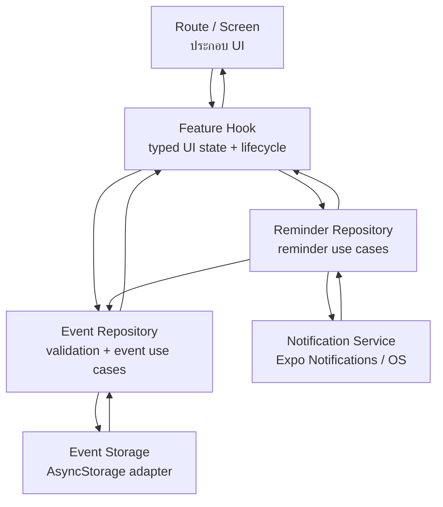

# Lab 12 — Architecture, Performance และ Accessibility

โปรเจกต์นี้ต่อยอดจาก **Khon Kaen Dino Explorer — Week 11** โดยหยุดเพิ่ม scope ใหม่ และปรับโครงสร้างตามปัญหาที่พบจริง ฟีเจอร์เดิม เช่น Search/Filter, My Trip, Camera, Profile, Event/Reminder และการลบกิจกรรมส่วนตัวยังคงอยู่

## 1) Architecture และ Data Flow



### Boundary และเหตุผล

| Layer | ไฟล์หลัก | หน้าที่ |
|---|---|---|
| Route / Screen | `app/events/index.tsx`, `app/events/[id].tsx` | ประกอบ UI, navigation, confirmation dialog |
| Feature Hook | `src/features/events/hooks/useEvents.ts`, `useEventDetail.ts` | loading/error state, lifecycle, เรียก use case |
| Feature Types / Components | `src/features/events/types.ts`, `EventCard.tsx` | type/domain helper และ reusable row |
| Repository | `src/repositories/eventRepository.ts` | validation, create/delete/list/find event |
| Repository | `src/repositories/reminderRepository.ts` | กฎเตือน 30 นาที, schedule/cancel, notification navigation |
| Storage | `src/storage/eventStorage.ts` | storage key และ JSON serialization |
| Device Service | `src/services/notificationService.ts` | permission, Android channel, schedule/cancel notification |
| Static data | `src/data/pointsOfInterest.ts` | POI คงที่ 10 จุด — ยังไม่สร้าง repository เพราะจะเป็น pass-through |

### Source of truth

| ข้อมูล | Source of truth | UI snapshot |
|---|---|---|
| Event | AsyncStorage ผ่าน `eventStorage → eventRepository` | state ใน event hooks |
| Reminder | scheduled notification queue ของ OS | `ReminderSnapshot` ใน `useEventDetail` |
| Notification permission | ระบบปฏิบัติการ | refresh เมื่อกลับเข้าแอป |
| Favorite / My Trip | AsyncStorage ผ่าน `src/services/favorites.ts` | state ใน Home / My Trip |
| POI | `src/data/pointsOfInterest.ts` | `selectedPoi` ใน Home |
| Session | **ไม่มีระบบ login/session ในโปรเจกต์นี้** | ไม่สร้าง abstraction ที่ไม่ได้ใช้ |

ไฟล์ logic Week 11 ที่ซ้ำกัน (`src/data/events.ts` และ `src/services/reminders.ts`) ถูกนำออก เพื่อให้ Event/Reminder มี source of truth ชุดเดียว

---

## 2) Performance Review

### Baseline — Week 11

ก่อน refactor หน้า Event list ใช้ `ScrollView` + `events.map(...)` ทำให้สร้าง card ทุกใบพร้อมกัน และ callback เปิดรายละเอียดถูกสร้างภายใน render ของรายการ

### Bottleneck ที่แก้

Week 12 เปลี่ยนเฉพาะจุดที่มีเหตุผลจากโครงสร้าง list:

- `FlatList` แทน eager `ScrollView + map`
- `keyExtractor = event.id`
- `initialNumToRender={6}`
- `maxToRenderPerBatch={6}`
- `windowSize={5}`
- `removeClippedSubviews` เฉพาะ Android
- แยก `EventCard` และห่อด้วย `memo`
- `openEvent`, `confirmDelete`, `renderEvent` ใช้ `useCallback`
- React `Profiler` ส่งค่าไปยัง `src/services/performanceLogger.ts`

ไม่ได้ใส่ `memo/useMemo/useCallback` ทุก component โดยไม่มีเหตุผล เช่น POI มีเพียง 10 จุดจึงยังไม่สร้าง abstraction/optimization เพิ่มโดยไม่วัด

### วิธีเก็บหลักฐานก่อน / หลัง

ใช้ **อุปกรณ์เครื่องเดียวกัน**, จำนวนกิจกรรมเท่ากัน และ Dev build แบบเดียวกัน

1. Week 11: เปิดหน้า Reminder → บันทึก React DevTools Profiler
2. พิมพ์ชื่อกิจกรรม 5 ตัวอักษร
3. เลื่อนรายการขึ้นลง 3 รอบ
4. เก็บ screenshot/flamegraph หรือ console trace
5. ทำขั้นตอนเดียวกันบน Week 12
6. Week 12 จะมี log รูปแบบ:

```text
[PROFILE] EventList update actual=...ms base=...ms
```

| Scenario | Week 11 | Week 12 | หลักฐาน |
|---|---:|---:|---|
| เปิดหน้า Event list | กรอกค่าจาก Profiler | กรอกค่าจาก Profiler | screenshot / flamegraph |
| พิมพ์ 5 ตัวอักษร | กรอกค่าจาก Profiler | กรอกค่าจาก Profiler | trace |
| Scroll 3 รอบ | กรอกค่าจาก Profiler | กรอกค่าจาก Profiler | trace |

> ห้ามกรอกตัวเลขสมมติ เอกสารนี้แยก **code evidence** ออกจาก **device measurement** ชัดเจน

---

## 3) Accessibility Audit — Before / After

| จุดตรวจ | ก่อน | หลัง |
|---|---|---|
| Semantics | หัวข้อสำคัญเป็น Text ปกติ | เพิ่ม `accessibilityRole="header"` |
| Loading / Error | status เปลี่ยนโดยไม่ประกาศ | เพิ่ม `accessibilityLiveRegion` และ role `alert` |
| Focus หลัง error/not-found | focus อาจค้างตำแหน่งเดิม | ย้าย accessibility focus ไปข้อความสถานะ |
| Form label | input มี label แต่ความสัมพันธ์กับ visible label ไม่ชัด | เพิ่ม `accessibilityLabelledBy` พร้อม fallback label |
| Touch target | ปุ่มบางจุดขึ้นกับ padding | Action / map / filter / trip controls มี target อย่างน้อย 48px |
| POI semantics | screen reader ไม่ได้อ่านชื่อ/หมวด/ที่อยู่ครบ | เพิ่ม label รวมและ selected state |
| Text scale | metadata POI ตัดด้วย `numberOfLines={1}` | เอาการตัดข้อความสำคัญออก |
| Motion | map/list animate เสมอ | `useReduceMotion` อ่าน Reduce Motion setting |
| Decorative image | logo อาจถูกอ่านซ้ำ | ซ่อน logo ตกแต่งจาก accessibility tree |
| Delete action | ใช้สีเป็นส่วนหนึ่งของ visual state | มีข้อความ “ลบกิจกรรมนี้” ชัดเจน ไม่พึ่งสีอย่างเดียว |

### Device audit checklist

- [ ] VoiceOver: Home → Search/Filter → เลือก POI → My Trip
- [ ] VoiceOver: Reminder → Event detail → ตั้ง/ยกเลิก reminder
- [ ] TalkBack: flow เดียวกันและตรวจ selected state
- [ ] Font scale 200%: ไม่มีข้อความสำคัญถูกตัด ปุ่มยังกดได้
- [ ] Reduce Motion: เปลี่ยน POI แล้วไม่เกิด animation ที่ไม่จำเป็น
- [ ] Invalid Event ID: focus ไปที่ “ไม่พบกิจกรรม”
- [ ] ลบกิจกรรมส่วนตัว: confirmation และปุ่มลบอ่านเข้าใจได้

รายการนี้ต้องยืนยันบนอุปกรณ์จริง เพราะ automated tests ไม่สามารถฟัง screen reader หรือยืนยัน layout ที่ font scale 200% ได้

---

## 4) Automated Checks

```bash
npm test
npm run typecheck
npx expo-doctor
```

ผลตรวจบน GitHub Actions ของ `main` ล่าสุด: **12/12 tests ผ่าน, 0 fail และ TypeScript check ผ่าน**

`tests/architecture.test.cjs` ตรวจ regression สำคัญ:

- Event screens ห้าม import AsyncStorage / Expo Notifications โดยตรง
- Event list ต้องใช้ FlatList + stable renderer + memoized row
- Accessibility semantics/live-region/touch-size/reduce-motion ต้องยังอยู่
- Storage และ device API ต้องอยู่หลัง repository boundary

---

## Definition of Done

- [x] Event screens ไม่ทำ storage/device API/render logic รวมกัน
- [x] Source of truth ของ Event, Reminder, Favorite และสถานะ session ชัดเจน
- [x] Optimization ผูกกับ bottleneck ของ Event list และมี Profiler สำหรับเก็บหลักฐาน
- [x] แก้ accessibility issues ใน code อย่างน้อย 5 จุด
- [ ] ยืนยัน flow หลักด้วย VoiceOver/TalkBack บนอุปกรณ์จริง
- [ ] ยืนยัน UI ที่ Font scale 200% บนอุปกรณ์จริง
- [ ] แนบ Performance trace ก่อน/หลังจากอุปกรณ์เดียวกัน

## Exit Ticket

1. **Abstraction แบบใดเพิ่มความซับซ้อนโดยไม่ให้ประโยชน์?**  
   ชั้นที่รับค่าแล้วส่งต่ออย่างเดียวโดยไม่มี validation, orchestration, cache หรือ boundary ที่ต้องเปลี่ยน เช่น repository ครอบ POI คงที่ในตอนนี้

2. **เพราะเหตุใดต้องวัดก่อน optimize?**  
   เพื่อรู้ bottleneck จริงและมี baseline เปรียบเทียบ ป้องกันการเพิ่ม memoization/dependency ที่ซับซ้อนแต่ไม่ช่วย performance

3. **Accessibility issue ใดส่งผลกับผู้ใช้ทั่วไปด้วย?**  
   touch target เล็ก, label ไม่ชัด, error หาไม่เจอ และข้อความถูกตัดเมื่อขนาดตัวอักษรใหญ่ ล้วนกระทบผู้ใช้ทั่วไปด้วย
