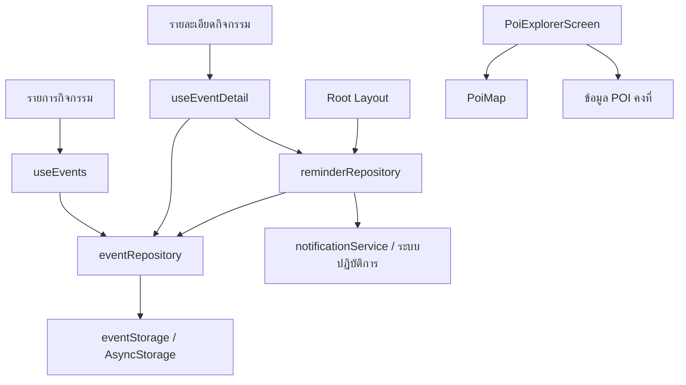

# Week 12 — รายงานตรวจโครงสร้าง Performance และ Accessibility

วันที่ตรวจ: 21 กันยายน 2569

ตรวจจาก `week12-architecture-performance-accessibility.zip` และ React DevTools exports ที่ผู้พัฒนาส่งมา รายงานนี้แยกข้อค้นพบจากโค้ด ผลการทดลอง และสิ่งที่ยังต้องยืนยัน ใช้ประกอบ `lab-12-quality-audit.md` เดิม โดยให้สถานะหลักฐานในรายงานนี้แทนช่องว่างหรือข้ออ้างที่ยังไม่ยืนยันในเอกสารเดิม

## 1. Architecture และเหตุผลของ boundary

ลูกศรแสดงการเรียกใช้ dependency; hook รับผลกลับแล้วเปลี่ยน state เพื่อ render หน้าจอใหม่ Root Layout รับ notification intent ผ่าน repository แล้วนำทางเมื่อ navigation พร้อม

| Boundary | ไฟล์จริง | เหตุผล |
|---|---|---|
| UI | `app/events/index.tsx`, `app/events/[id].tsx` | ประกอบ UI, form state, navigation และข้อความแจ้งผู้ใช้ |
| Feature hooks | `src/features/events/hooks/useEvents.ts`, `useEventDetail.ts` | จัดการ loading/error, focus lifecycle และคำสั่งจาก UI; generation counter กันผล async เก่ามาทับ state |
| Event repository | `src/repositories/eventRepository.ts` | ตรวจข้อมูล สร้างกิจกรรม โหลด seed/cache และค้นจาก ID |
| Reminder repository | `src/repositories/reminderRepository.ts` | กฎเตือนล่วงหน้า 30 นาที แยก test reminder และเรียงลำดับ schedule/cancel |
| Storage | `src/storage/eventStorage.ts` | ซ่อน storage key และ JSON serialization |
| Device service | `src/services/notificationService.ts` | permission, Android channel, scheduling, response และ AppState |
| Types | `src/features/events/types.ts` | รูปแบบ CampusEvent และการตรวจ event ID |

POI เป็นข้อมูลคงที่จึงยังไม่ต้องสร้าง repository ที่เพียงส่งค่าต่อ ส่วน `formatEventTime` ถูกเรียกจาก UI ผ่านไฟล์ repository เป็น helper สำหรับแสดงผล ไม่ใช่การทำ storage ใน screen

### Source of truth

| ข้อมูล | แหล่งหลัก | สำเนาที่ UI ใช้ |
|---|---|---|
| กิจกรรม | AsyncStorage ผ่าน eventRepository; มี cache ในหน่วยความจำ | hook state |
| รายการเตือนที่รอส่ง | scheduled queue ของระบบปฏิบัติการ | ReminderSnapshot |
| Permission | ระบบปฏิบัติการ | snapshot ที่ refresh เมื่อกลับเข้าแอป |
| POI | `src/data/pointsOfInterest.ts` | selectedPoi ใน screen |
| ฟอร์มที่ยังไม่บันทึก | state ของหน้ารายการ | title, startsAt, picker |
| Favorite / session | ไม่พบระบบนี้ในโปรเจกต์ที่ตรวจ | ไม่อ้างว่ามีหรือเพิ่มฟีเจอร์เพื่อการ refactor |

## 2. Performance — หลักฐานจริง

ไฟล์คู่ล่าสุดอยู่ใน `evidence/` เป็นการใช้ Expo Go บน iPhone ตามที่ผู้พัฒนารายงาน บันทึกผ่าน React Native DevTools ในโหมดพัฒนา ไม่ใช่ release benchmark ไม่ได้บันทึกรุ่น iPhone, iOS, จำนวนกิจกรรม และ fontScale ที่แน่นอน จึงไม่ถือว่าควบคุมตัวแปรครบถ้วน

ชื่อไฟล์มีคำว่า list แต่ trace มี navigation ด้วย จึงใช้ชื่อ scenario ว่า **เปิดหน้ารายการและใช้งานรายการ** ไม่เรียกผลนี้ว่าเวลาเลื่อนรายการล้วน

| ค่าจาก commitData.duration | Week 11 | Week 12 |
|---|---:|---:|
| React commits | 10 | 10 |
| ผลรวม render duration | 56.317 ms | 50.596 ms |
| เฉลี่ยต่อ commit | 5.6317 ms | 5.0596 ms |
| ค่าสูงสุด | 33.097 ms | 30.558 ms |

ผลรวมลดลง 5.721 ms หรือประมาณ 10.16% **เฉพาะคู่นี้** ลำดับ updaters ตรงกันทั้ง 10 commits แต่ไม่ได้พิสูจน์ว่าข้อมูลหรือการใช้งานเหมือนกันทุกอย่าง ค่าสูงสุดของทั้งสองไฟล์มี BaseNavigationContainer เป็น updater จึงไม่สามารถยกเวลานั้นให้ EventCard ทั้งหมด หรืออ้างว่า memo ทำให้แอปเร็วขึ้น 10.16%

ผลรวมนี้เป็นเวลาที่ React ใช้ render ใน commits ที่บันทึก ไม่ใช่เวลาตอบสนองทั้ง flow, FPS หรือเวลา animation; จำนวน commits ไม่ใช่จำนวนเฟรม การทดสอบครั้งเดียวอาจมีความแปรปรวนจากเครื่องและ dev tooling

### สิ่งที่ตรวจพบในโค้ด Week 12

- Event list ใช้ FlatList, key เป็น event.id, initialNumToRender=6, maxToRenderPerBatch=6 และ windowSize=5
- EventCard ใช้ memo; openEvent และ renderEvent ใช้ useCallback
- Profiler ชื่อ EventList ครอบ FlatList ซึ่งรวมฟอร์มใน ListHeaderComponent ด้วย จึงไม่ได้วัดเฉพาะ card
- removeClippedSubviews เปิดเฉพาะ Android
- actualDuration กับ baseDuration ใน console ไม่ใช่ผลก่อน/หลังจากคนละเวอร์ชัน

ตรวจเพิ่มจาก `khon-kaen-poi(1).zip`: ประวัติ Git มี HEAD `f9b4589` ข้อความ `Add Notifications to Week 10 Project for Week 11` และ source ที่ส่งมามี ScrollView กับ events.map จริง ส่วน Week 12 เปลี่ยนเป็น FlatList และแยก memoized EventCard พร้อม stable callbacks แล้ว ดู source diff ใน `evidence/week11-to-week12.diff` การเปลี่ยนโครงสร้างนี้ยืนยันได้ แต่ยังไม่พิสูจน์จาก trace ที่มีว่าได้วัด bottleneck ก่อนเพิ่ม optimization หรือว่า memo เป็นสาเหตุของเวลาที่ลดลง

**สถานะ:** มี source ก่อน/หลังและ trace ประกอบแล้ว เห็นการเปลี่ยน eager list เป็น virtualized list ชัดเจน แต่หลักฐานเฉพาะ bottleneck ยังจำกัด เพราะ trace รวม navigation และไม่ได้ควบคุมจำนวนรายการหรือแยกผลของ memo ไม่ต้องเก็บ trace แบบเดิมซ้ำโดยไม่มีคำถามใหม่

## 3. Accessibility audit

ตรวจ source Week 11 เทียบ Week 12 แล้ว พบการเปลี่ยนจริงดังตารางก่อน–หลังด้านล่าง ส่วนผลใช้งานบนอุปกรณ์ให้แยกจากหลักฐานโค้ด

### Before / After ที่ยืนยันจาก source

| จุด | Week 11 ก่อนแก้ | Week 12 หลังแก้ | ไฟล์ |
|---|---|---|---|
| Heading semantics | หัวข้อเป็น Text ไม่มี header role | เพิ่ม header role ให้หัวข้อ | `app/events/index.tsx`, `src/screens/PoiExplorerScreen.tsx` |
| Loading / error | แสดง Text ธรรมดา | เพิ่ม live region และ alert role | `app/events/index.tsx`, `app/events/[id].tsx` |
| Error focus | ไม่มีการตั้ง accessibility focus | statusRef และ setAccessibilityFocus เมื่อ error/not found | `app/events/[id].tsx` |
| Touch target | ปุ่ม Action ใช้ padding 15 ไม่มี minHeight/hitSlop | minHeight 48, hitSlop 4 และข้อความยืดได้ | `src/components/EventUI.tsx` |
| POI label | มี role และ selected state อยู่แล้ว แต่ไม่มี label รวมรายละเอียด | เพิ่ม label ชื่อ ประเภท ที่อยู่ | `src/screens/PoiExplorerScreen.tsx` |
| ข้อความยาว | metadata ของ POI และชื่อ/ที่อยู่แผนที่จำกัดจำนวนบรรทัด | นำข้อจำกัดบรรทัดของข้อความเหล่านี้ออก | `src/screens/PoiExplorerScreen.tsx`, `src/components/PoiMap.tsx` |
| Reduce Motion | scroll animated=true และ map duration 550/450 เสมอ | ใช้ preference ปิด scroll animation และ map duration=0 | `src/screens/PoiExplorerScreen.tsx`, `src/components/PoiMap.tsx` |
| รูปตกแต่ง | โลโก้ไม่ได้ตั้ง accessible=false | เพิ่ม accessible=false | `src/screens/PoiExplorerScreen.tsx` |
| Form label | มี accessibilityLabel อยู่แล้ว | เพิ่ม nativeID และ accessibilityLabelledBy เชื่อม visible label | `app/events/index.tsx` |

ไม่กล่าวว่าปุ่ม Week 11 ไม่มี role หรือ input ไม่มี label เพราะ source เดิมมีอยู่แล้ว และไม่มี minHeight ไม่ได้แปลว่าขนาดจริงเล็กกว่า 48 เสมอ การเปลี่ยนเหล่านี้ต้องตรวจ UX จริงประกอบ

Baseline ใช้ **working files ภายใน ZIP ที่ส่งมา** ไม่ใช่ checkout ที่สะอาดของ f9b4589: git status พบ tracked files ที่เปลี่ยนและไฟล์ที่ถูกลบ ดังนั้น SHA นี้เป็นเพียง HEAD ของประวัติที่แนบมา ไม่ใช่การรับรองว่า source ใน ZIP ตรงกับ commit ทุกไฟล์ และยังไม่มี build hash ผูก profiler exports กับ source snapshot โดยตรง

### Architecture ก่อน–หลัง

Week 11 หน้ารายละเอียด import expo-notifications โดยตรง เรียก getPermissionsAsync และตั้ง notification listener ใน screen; Week 12 ย้ายไป notificationService และ reminderRepository ผ่าน useEventDetail ส่วนรายการย้าย loading/error/focus orchestration ไป useEvents ข้อมูลเก่าที่อยู่ใน src/data/events.ts ถูกแยกเป็น repository และ storage adapter ชัดเจนขึ้น ไม่ใช่การย้ายชื่อไฟล์อย่างเดียว

| จุดตรวจ | สิ่งที่มีใน Week 12 | หลักฐานและสถานะ |
|---|---|---|
| Heading | Text หลัก/หัวข้อส่วนและชื่อกิจกรรมมี role header | ตรวจพบใน event screens, EventCard และ PoiExplorerScreen |
| ปุ่มและสถานะ | Action มี label, role button, disabled state | ตรวจพบใน EventUI.tsx; ยังต้องยืนยันการอ่านและกดด้วย VoiceOver |
| Touch target | Action มี minHeight 48 และ hitSlop 4 | ตรวจพบจาก style; ไม่เหมารวมว่าปุ่มทุกจุดในแอปผ่าน |
| Input label | ชื่อกิจกรรมมี visible label, accessibilityLabel และ labelledBy | ตรวจพบในหน้ารายการ; ต้องตรวจเสียงจริงตามแพลตฟอร์ม |
| Error / Not found focus | ตั้ง focus ไปยัง statusRef หลังโหลดเสร็จ | ตรวจพบในหน้ารายละเอียด; ยังไม่ยืนยันพฤติกรรมจริง |
| POI selection | label รวมชื่อ ประเภท ที่อยู่ และ selected state | ตรวจพบใน PoiExplorerScreen |
| Reduce motion | hook อ่าน setting/listener; map duration เป็น 0 และ scroll ปิด animation | ตรวจพบใน useReduceMotion, PoiMap และ PoiExplorerScreen; ยังไม่มีผลทดลองจริง |
| รูปตกแต่ง | โลโก้ accessible=false | ตรวจพบใน PoiExplorerScreen |
| ข้อความขยาย | ปุ่มไม่มีความสูงตายตัว และข้อความรองรับการขึ้นบรรทัด | ภาพจากผู้พัฒนาแสดงข้อความขยายและปุ่มเพิ่มความสูง แต่ยังไม่ยืนยัน fontScale=2.0 |
| Dynamic status | มี accessibilityLiveRegion และ alert role | เป็นหลักฐานโค้ด ไม่ใช่หลักฐานการประกาศเสียงครบทุกแพลตฟอร์ม |

### ผลที่ผู้พัฒนาทดลองไว้

- ผู้พัฒนารายงานว่า VoiceOver อ่านเนื้อหาได้ แต่ยังไม่มีบันทึกยืนยันลำดับ focus และการกดทุกปุ่มใน flow
- ภาพตัวอักษรขนาดใหญ่แสดงการตัดบรรทัดและหน้าเลื่อนได้บางส่วน ยังไม่ยืนยันทุกหน้าหรือค่าขยาย 200% ที่แน่นอน
- ภาพก่อนหน้ามีปุ่มย้อนกลับชื่อ `index` ควรตรวจชื่อที่อ่านว่ามีความหมายต่อผู้ใช้
- ภาพ notification ยืนยันว่ามี banner ขณะอยู่ในแอปและหน้าจอ Home แต่ไม่ใช่ผลการตรวจ accessibility ทั้งระบบ

### รายการก่อนปิดงาน

- [x] เทียบ source Week 11 เพื่อบันทึก before/after ของการแก้ accessibility อย่างน้อย 5 จุด (ยืนยัน 9 รายการข้างต้น; ยังไม่ใช่การผ่าน device audit ทั้งหมด)
- [ ] VoiceOver: เข้ารายการ เปิดรายละเอียด ตั้ง/ยกเลิกเตือน กลับรายการ โดย swipe focus และ double-tap ได้ครบ
- [ ] ยืนยันค่าขยาย 200% และตรวจรายการ ฟอร์ม รายละเอียด ปุ่มล่าง และข้อความ error
- [ ] ทดสอบ invalid ID ว่าอ่าน Not found และกดกลับได้
- [ ] ทดสอบ Reduce Motion จริงและบันทึกผล
- [ ] TalkBack ถ้าจะอ้างว่ารองรับ Android ที่ผ่านการทดลองแล้ว

ไม่ติ๊กผ่านรายการที่ยังไม่มีหลักฐาน และไม่ถือว่าภาพนิ่งยืนยัน contrast ratio หรือการใช้งานด้วย screen reader ทั้ง flow

## 4. Verification

รอบตรวจนี้รัน `node --test tests/architecture.test.cjs`: **ผ่าน 3/3** เป็นการตรวจข้อความใน source ไม่ใช่ runtime/performance/a11y test

ผู้พัฒนาเคยส่งภาพ `npm test` ผ่าน 10/10 และ `npm run typecheck` ไม่พบ error; นับเป็นผลจากเครื่องผู้พัฒนาในเวลานั้น รอบนี้ไม่ได้ติดตั้ง dependencies หรือรัน native build ใหม่ จึงไม่อ้างว่าทดสอบบน iPhone แทนผู้พัฒนาแล้ว

## 5. Exit ticket

1. Abstraction ที่เพิ่มความซับซ้อน: wrapper ที่ส่งค่าต่ออย่างเดียว โดยไม่มี validation, orchestration หรือ boundary ที่จำเป็น เช่น repository ครอบข้อมูล POI คงที่โดยไม่มีหน้าที่เพิ่ม
2. ต้องวัดก่อน optimize เพื่อรู้ว่า interaction และ component ใดเป็นคอขวด และแยกผลของการแก้จากความแปรปรวน ไม่เพิ่ม memo ทุกจุดโดยไม่มีเหตุผล
3. ปุ่มเล็ก label ไม่ชัด ข้อความถูกตัด และ error หาไม่เจอ กระทบผู้ใช้ทั่วไปด้วย ไม่เฉพาะผู้ใช้เทคโนโลยีช่วยเหลือ
